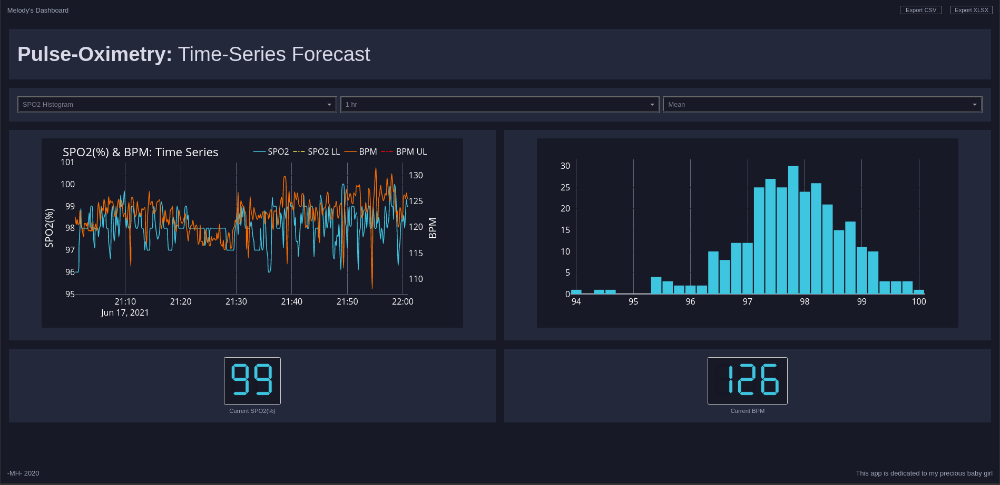
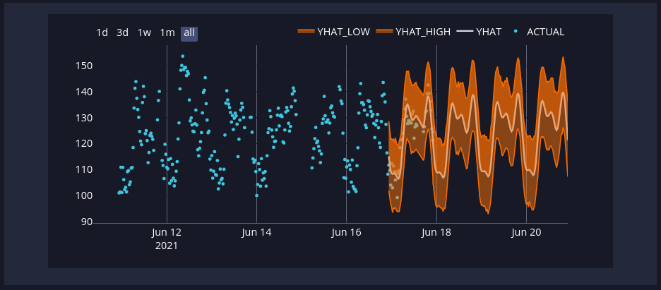
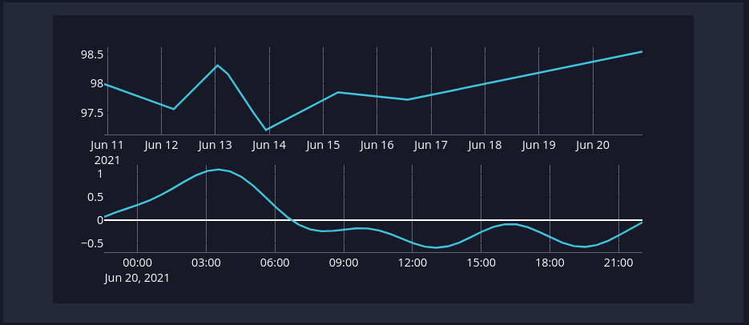

# Dash App: Pulse-Oximeter Dashboard w/ fbProphet Forecasting

This **Dash** application was created to monitor my daughters current SPO2 and BPM reads. The
data is captured from a **Masimo Rad-8** Pulse Oximeter via **RPI-Zero-W**, serially (DB9 to USB) using
an FTDI chip and RS232. The serial data is parsed and pushed to an **InfluxDB 2.x** Cloud Instance.
The Dash Application queries said InfluxDB Cloud Instance for almost realtime display.

## Plot Options

The default plot (left side) displays one hour of the SPO2 and BPM which updates continuously every 5 seconds and is aggregated
by 5 seconds. The second plot (right side) displays downsampled SPO2 data (mean of 15 minutes) in a histogram containing 7-days.
Other plot types available are BPM histogram, fbProphet forecast for both SPO2 and BPM as well as the component plots for each.
The aggregation methods available are mean, median and standard deviation.

## Screenshot of default dashboard upon open

## Screenshot of Heartrate fbProphet 3-day forecast

## Screenshot of Specific Oxygen fbProphet Component Plot

